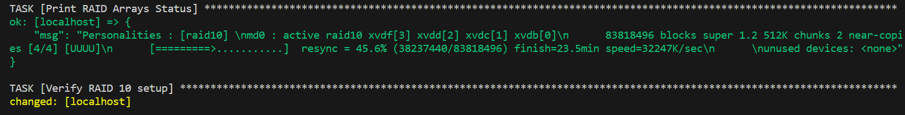
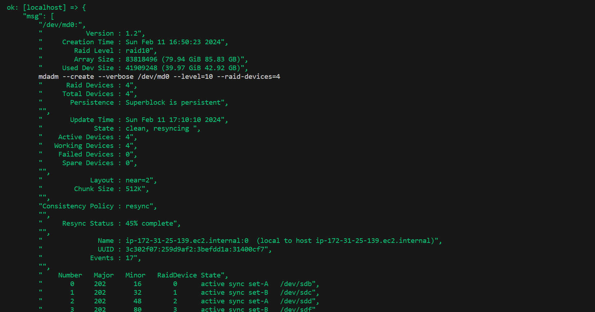

## Setup Raid 10 on EC2 with ansible.
##### This playbook performs the following tasks:

* Install mdadm: Installs the RAID management tool.
* Zero superblocks: Clears existing RAID configurations on the disks.
* Create RAID 10 array: Combines the disks into a RAID 10 array.
* Create filesystem: Formats the RAID array with the ext4 filesystem.
* Mount RAID array: Mounts the RAID array to /mnt/raid10.
* Save RAID configuration: Ensures the RAID setup persists across reboots.
* Verify RAID configuration.
* Check all RAID arrays.

1. Login to EC2 and list available disk.
```bash
[root@ip-172-31-25-139 ~]# fdisk -l
Disk /dev/xvda: 40 GiB, 42949672960 bytes, 83886080 sectors
Units: sectors of 1 * 512 = 512 bytes
Sector size (logical/physical): 512 bytes / 512 bytes
I/O size (minimum/optimal): 512 bytes / 512 bytes
Disklabel type: gpt
Disk identifier: AF668AF2-2DD9-47EF-9CD5-26F76EB55FE5

Device       Start      End  Sectors Size Type
/dev/xvda1   24576 83886046 83861471  40G Linux filesystem
/dev/xvda127 22528    24575     2048   1M BIOS boot
/dev/xvda128  2048    22527    20480  10M EFI System

Partition table entries are not in disk order.


Disk /dev/xvdd: 40 GiB, 42949672960 bytes, 83886080 sectors
Units: sectors of 1 * 512 = 512 bytes
Sector size (logical/physical): 512 bytes / 512 bytes
I/O size (minimum/optimal): 512 bytes / 512 bytes


Disk /dev/xvde: 40 GiB, 42949672960 bytes, 83886080 sectors
Units: sectors of 1 * 512 = 512 bytes
Sector size (logical/physical): 512 bytes / 512 bytes
I/O size (minimum/optimal): 512 bytes / 512 bytes


Disk /dev/xvdb: 40 GiB, 42949672960 bytes, 83886080 sectors
Units: sectors of 1 * 512 = 512 bytes
Sector size (logical/physical): 512 bytes / 512 bytes
I/O size (minimum/optimal): 512 bytes / 512 bytes


Disk /dev/xvdc: 40 GiB, 42949672960 bytes, 83886080 sectors
Units: sectors of 1 * 512 = 512 bytes
Sector size (logical/physical): 512 bytes / 512 bytes
I/O size (minimum/optimal): 512 bytes / 512 bytes


Disk /dev/xvdf: 40 GiB, 42949672960 bytes, 83886080 sectors
Units: sectors of 1 * 512 = 512 bytes
Sector size (logical/physical): 512 bytes / 512 bytes
I/O size (minimum/optimal): 512 bytes / 512 bytes
```
2. Run playbook.

```bash
ansible-playbook setup_raid10_local.yml
```
3. Results






